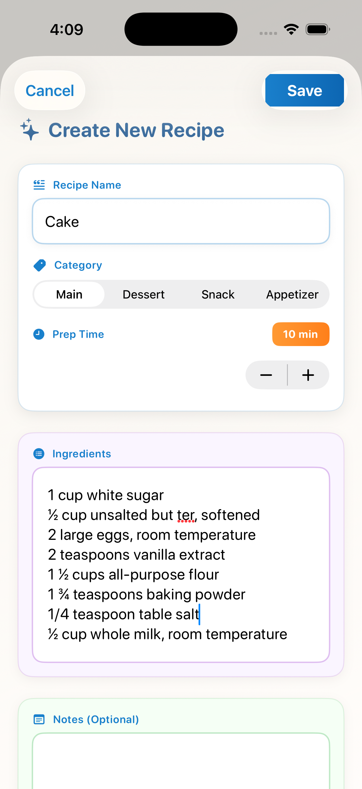
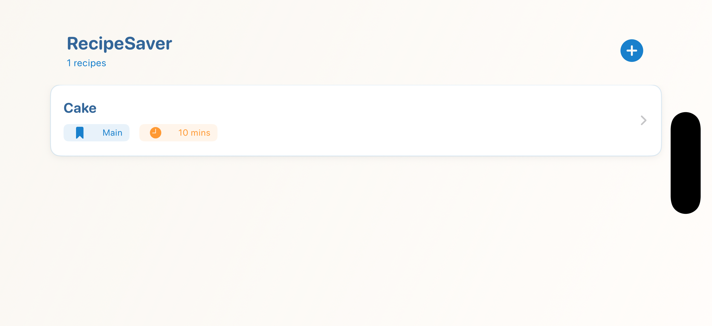
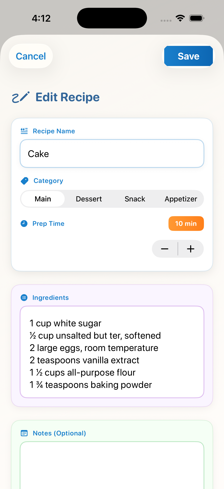
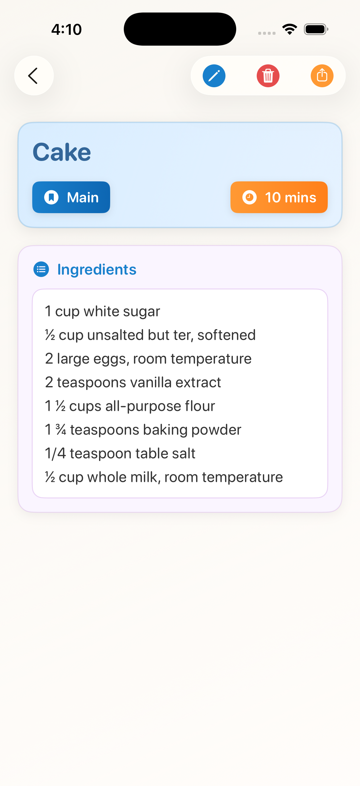
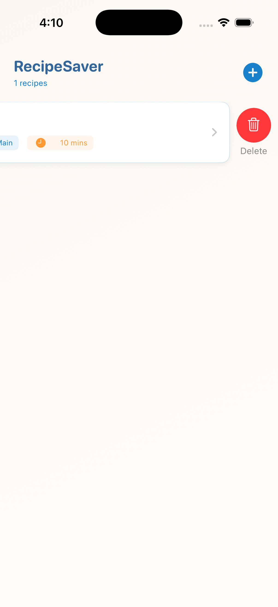

<h1>RecipeSaver 📱</h1>

A beautiful and intuitive iOS recipe management app built with SwiftUI. Store, organize, and manage all your favorite recipes in one elegant place.

<strong>Repository:</strong> <a href="https://github.com/dhruvjivani/Recipesaver" target="_blank" rel="noopener noreferrer">https://github.com/dhruvjivani/Recipesaver</a>

<h2>✨ Features</h2>

<ul>
  <li>✅ <strong>Create & Edit Recipes</strong> - Add new recipes with ingredients, prep time, and notes</li>
  <li>✅ <strong>Organize by Category</strong> - Sort recipes into Main, Dessert, Snack, or Appetizer</li>
  <li>✅ <strong>Beautiful Light Theme</strong> - Modern, clean design with professional color scheme</li>
  <li>✅ <strong>Quick Preview</strong> - View recipe details with one tap</li>
  <li>✅ <strong>Delete Recipes</strong> - Remove recipes with swipe-to-delete gesture</li>
  <li>✅ <strong>Export Recipes</strong> - Share your recipes with others</li>
  <li>✅ <strong>Core Data Integration</strong> - Persistent storage for all recipes</li>
  <li>✅ <strong>Responsive UI</strong> - Smooth animations and transitions</li>
</ul>

<h2>🎨 Design Overview</h2>

RecipeSaver features a premium light theme with:

<ul>
  <li><strong>Primary Color:</strong> Professional Blue (#1A80CC)</li>
  <li><strong>Accent Color:</strong> Warm Orange (#FF9933)</li>
  <li><strong>Background:</strong> Soft cream gradients</li>
  <li><strong>Cards:</strong> Clean white backgrounds with subtle shadows</li>
  <li><strong>Typography:</strong> Rounded, modern font design</li>
</ul>

<h2>📸 Screenshots</h2>

<!-- Container for 4 images in a single row -->

  

    
    
1. Add Recipe Screen

  

  
  

    
    
2. Recipe List Screen

  

  
  

    
    
3. Edit Recipe Screen

  

  
  

    
    
4. Recipe Detail Screen

  

<!-- Single image below -->

  
  
5. Full Recipe List View

<h2>🛠️ Tech Stack</h2>

<ul>
  <li><strong>Framework:</strong> SwiftUI</li>
  <li><strong>Database:</strong> Core Data</li>
  <li><strong>Language:</strong> Swift</li>
  <li><strong>iOS Version:</strong> iOS 14+</li>
  <li><strong>Architecture:</strong> MVVM Pattern</li>
</ul>

<h2>📁 Project Structure</h2>

<pre>
RecipeSaver/
├── Views/
│   ├── AddRecipeView.swift
│   ├── EditRecipeView.swift
│   ├── RecipeDetailView.swift
│   └── RecipeListView.swift
├── Models/
│   └── Recipe.swift
├── Helpers/
│   └── FileExporter.swift
└── RecipeSaverApp.swift
</pre>

<h2>🚀 Getting Started</h2>

<h3>Prerequisites</h3>
<ul>
  <li>Xcode 13.0 or later</li>
  <li>iOS 14.0 or later</li>
  <li>Swift 5.5+</li>
</ul>

<h3>Installation</h3>

<ol>
  <li>Clone the repository: 
    <code>git clone https://github.com/dhruvjivani/Recipesaver.git cd RecipeSaver</code>
  </li>
  <li>Open the project in Xcode: 
    <code>open RecipeSaver.xcodeproj</code>
  </li>
  <li>Build and run: 
    Select your target device/simulator and press <code>Cmd + R</code> or click Run
  </li>
</ol>

<h2>💡 Usage</h2>

<h3>Adding a Recipe</h3>
<ol>
  <li>Tap the <strong>+</strong> button on the home screen</li>
  <li>Enter recipe name</li>
  <li>Select category</li>
  <li>Adjust prep time using the stepper</li>
  <li>Add ingredients (one per line)</li>
  <li>Optionally add notes</li>
  <li>Tap <strong>Save</strong></li>
</ol>

<h3>Editing a Recipe</h3>
<ol>
  <li>Navigate to recipe detail screen</li>
  <li>Tap the <strong>pencil icon</strong> in the top toolbar</li>
  <li>Make your changes</li>
  <li>Tap <strong>Save</strong></li>
</ol>

<h3>Deleting a Recipe</h3>
<ul>
  <li><strong>Option 1:</strong> Swipe left on the recipe in the list and tap Delete</li>
  <li><strong>Option 2:</strong> Open recipe detail and tap the <strong>trash icon</strong></li>
</ul>

<h3>Exporting a Recipe</h3>
<ol>
  <li>Open recipe detail</li>
  <li>Tap the <strong>share icon</strong></li>
  <li>Choose your sharing method</li>
</ol>

<h2>🎯 Color Palette</h2>

<table>
  <thead>
    <tr>
      <th>Element</th>
      <th>Color</th>
      <th>Hex Code</th>
    </tr>
  </thead>
  <tbody>
    <tr><td>Primary Text</td><td>Deep Blue</td><td>#1A80CC</td></tr>
    <tr><td>Header</td><td>Light Blue</td><td>#334477</td></tr>
    <tr><td>Background Gradient</td><td>Cream</td><td>#F8F7F5 → #FFFBF8</td></tr>
    <tr><td>Accent - Time</td><td>Orange</td><td>#FF9933</td></tr>
    <tr><td>Card Background</td><td>White</td><td>#FFFFFF</td></tr>
    <tr><td>Border (Subtle)</td><td>Light Gray</td><td>#E0E0E0</td></tr>
  </tbody>
</table>

<h2>📱 UI Components</h2>

<h3>Buttons</h3>
<ul>
  <li><strong>Blue Save Button:</strong> Gradient background, white text</li>
  <li><strong>Segmented Picker:</strong> Category selection with blue tint</li>
  <li><strong>Icon Buttons:</strong> Edit (blue), Delete (red), Export (orange)</li>
</ul>

<h3>Cards</h3>
<ul>
  <li>Rounded corners (16pt radius)</li>
  <li>Subtle shadows for depth</li>
  <li>Colored borders based on section</li>
  <li>Semi-transparent backgrounds</li>
</ul>

<h3>Typography</h3>
<ul>
  <li><strong>Titles:</strong> System rounded, 18pt, bold</li>
  <li><strong>Labels:</strong> System rounded, 12pt, semibold</li>
  <li><strong>Body:</strong> System rounded, 16pt, regular</li>
</ul>

<h2>🔧 Future Enhancements</h2>

<ul>
  <li>Search functionality</li>
  <li>Recipe favorites/starred feature</li>
  <li>Cooking timer integration</li>
  <li>Recipe sharing with cloud sync</li>
  <li>Photo upload for recipes</li>
  <li>Ingredient quantity calculator</li>
  <li>Dietary preference filtering</li>
  <li>Dark mode support</li>
</ul>

<h2>📝 License</h2>

This project is open source and available under the MIT License.

<h2>👨‍💻 Author</h2>

<strong>Dhruv Rasikbhai Jivani</strong> 
GitHub: <a href="https://github.com/dhruvjivani" target="_blank" rel="noopener noreferrer">@dhruvjivani</a> 
Repository: <a href="https://github.com/dhruvjivani/Recipesaver" target="_blank" rel="noopener noreferrer">RecipeSaver</a>

<h2>🤝 Contributing</h2>

Contributions are welcome! To contribute:

<ol>
  <li>Fork the repository</li>
  <li>Create a feature branch (<code>git checkout -b feature/amazing-feature</code>)</li>
  <li>Commit your changes (<code>git commit -m 'Add amazing feature'</code>)</li>
  <li>Push to the branch (<code>git push origin feature/amazing-feature</code>)</li>
  <li>Open a Pull Request</li>
</ol>

<h2>💬 Support</h2>

For support, please open an issue on the <a href="https://github.com/dhruvjivani/Recipesaver/issues" target="_blank" rel="noopener noreferrer">GitHub repository</a>.

<h2>🙏 Acknowledgments</h2>

<ul>
  <li>Built with SwiftUI and Core Data</li>
  <li>Inspired by modern recipe management apps</li>
  <li>Beautiful light theme design</li>
  <li>Professional iOS development practices</li>
</ul>

<strong>Happy Recipe Saving! 🍳📖</strong>

If you have questions, contact Dhruv Jivani at <a href="mailto:dhruvjivani.ca001@gmail.com">dhruvjivani.ca001@gmail.com</a>.

